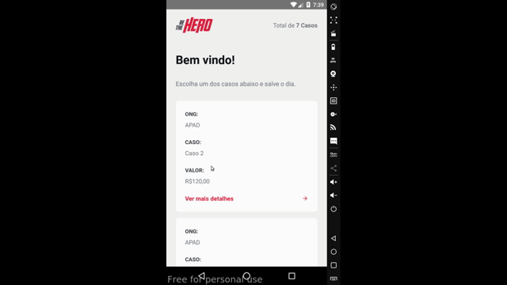
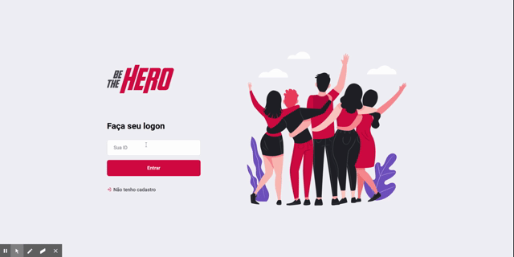

> developed during the omnistack week 11 

- Back end with [Node.Js](https://nodejs.org/en/);
- Web with [React](https://pt-br.reactjs.org/);
- Mobile with [React Native](https://reactnative.dev/);
- Automatic build and run __In Progress__

## Interface Mobile

    

## Interface Web

    

